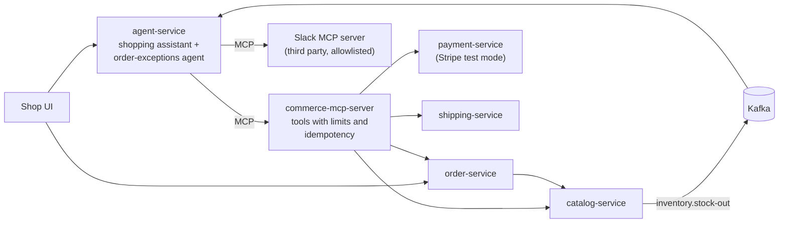

# spring-ai-agentic-commerce

Governed AI agents on top of ordinary Spring Boot microservices, built with Spring AI and the Model Context
Protocol (MCP).

The point of this project is to show how to add AI agents to an existing Java system **safely**: the agents handle
the situations that need judgment, every action they take goes through tools with limits enforced in code, and
every decision can be traced and audited afterwards.

> **Status: week 1 of 4.** The commerce services and the stock-out event are built and tested. The MCP server,
> the agents and the governance layer come next; see [Roadmap](#roadmap).

## The idea

An online shop's normal path (browse, order, pay, ship) stays plain, fast, deterministic code. **No AI agent sits
on the checkout path:** it would make every order slower, more expensive and less predictable.

Agents are used where judgment is needed:

- an item goes out of stock after the customer has already ordered it
- a customer asks the shop assistant to cancel, or asks where their order is
- a payment fails or a shipment is delayed
- deciding on a refund: full, partial, or ask a human

## Architecture



Built so far: `catalog-service`, `order-service` and the `inventory.stock-out` event. Everything else is on the
roadmap.

## Demo scenarios

1. **Order through chat.** A customer asks the shopping assistant for a product, confirms, and the order is placed.
2. **Stock-out after ordering.** Damaged goods are written off; the agent cancels the affected order, refunds it and
   notifies the customer. The order's timeline shows every step and why.
3. **Refund above the limit.** The agent pauses and asks a human; the approval is recorded.
4. **Payment service down.** The agent retries, then escalates instead of guessing.

## Services built so far

### catalog-service (port 8081)

Products and their stock. Each product tracks units **on hand** and units **reserved** for open orders.

| Method and path | What it does |
|---|---|
| `GET /api/products` | List products with on-hand, reserved and available units |
| `GET /api/products/{productId}` | One product |
| `POST /api/products/{productId}/reservations` | Reserve units for an order. Repeating the same request returns the same reservation |
| `DELETE /api/orders/{orderId}/reservations` | Release everything reserved for an order. Releasing twice changes nothing |
| `POST /api/products/{productId}/stock-adjustments` | Record a delivery (`delta` > 0) or a write-off (`delta` < 0) with a reason |

When a write-off leaves fewer units on hand than are reserved, the catalog publishes an event on the
`inventory.stock-out` topic. It names the **newest** orders that together cover the shortfall: the orders that can
no longer be fulfilled as placed. The catalog does not decide what happens to them; that judgment is the agent's
job.

```json
{
  "eventId": "82079e5c-514f-49d9-a0e5-603a82ef07c7",
  "occurredAt": "2026-10-02T09:07:30.125Z",
  "productId": "8c1f8a52-6f53-4f37-9d2e-1b0a9a6c0002",
  "sku": "RUN-SHOE-BLUE-43",
  "onHand": 1,
  "reserved": 2,
  "shortfall": 1,
  "reason": "damaged in warehouse",
  "affectedOrderIds": ["f62f98ab-7dc4-40eb-981b-d41b71304ad2"]
}
```

### order-service (port 8082)

| Method and path | What it does |
|---|---|
| `POST /api/orders` | Place an order: prices each line from the catalog and reserves its stock |
| `GET /api/orders/{orderId}` | One order |
| `GET /api/orders?customerEmail=…` | A customer's orders, newest first |
| `POST /api/orders/{orderId}/cancellation` | Cancel with a reason and release the stock. Cancelling twice keeps the first reason |

Errors use the standard Problem Details format (RFC 9457).

## Design decisions

- **The agent is not on the checkout path.** Placing an order is plain code; agents handle exceptions.
- **Deterministic work stays in code.** Which orders a stock-out affects is calculated by the catalog, not guessed
  by a model.
- **Stock changes lock the product row,** so concurrent reservations and write-offs on the same product run one
  after another and never reserve more than is available.
- **No database transaction is held open across remote calls.** Placing an order reserves stock in the catalog
  first; if any step fails, the order service releases whatever it reserved and saves nothing.
- **Events are published after the database commit,** so a consumer never sees a change that was rolled back. The
  trade-off: if the process dies between commit and send, the event is lost. A transactional outbox closes that
  gap; it is left out to keep the demo small.
- **The event is a JSON contract, not a Java type.** No Java class names travel in Kafka headers.

## Run it locally

You need Java 21, Maven and Docker.

```bash
docker compose up -d                              # Postgres and Kafka
mvn package -DskipTests
java -jar catalog-service/target/catalog-service-0.1.0-SNAPSHOT.jar &
java -jar order-service/target/order-service-0.1.0-SNAPSHOT.jar &
```

Then try the stock-out scenario:

```bash
SHOE=8c1f8a52-6f53-4f37-9d2e-1b0a9a6c0002   # seeded with 3 units

# Two customers each order one pair
for email in ada@example.com grace@example.com; do
  curl -s -X POST localhost:8082/api/orders -H 'Content-Type: application/json' \
    -d "{\"customerEmail\":\"$email\",\"lines\":[{\"productId\":\"$SHOE\",\"quantity\":1}]}"
done

# Two pairs are found damaged
curl -s -X POST localhost:8081/api/products/$SHOE/stock-adjustments -H 'Content-Type: application/json' \
  -d '{"delta":-2,"reason":"damaged in warehouse"}'

# Read the stock-out event
docker compose exec kafka /opt/kafka/bin/kafka-console-consumer.sh \
  --bootstrap-server localhost:9092 --topic inventory.stock-out --from-beginning --max-messages 1
```

## Tests

```bash
mvn verify
```

The integration tests run each service against real Postgres and Kafka containers (Testcontainers). The order
service's tests talk to the catalog over real HTTP, with WireMock standing in for it.

## Roadmap

| Week | Delivers |
|---|---|
| 1 ✅ | catalog-service, order-service, the stock-out event, CI |
| 2 | commerce-mcp-server and the order-exceptions agent: scenario 2 end to end |
| 3 | Shopping assistant, Stripe test-mode payments, refund limits with human approval, idempotent tools, audit trail, OpenTelemetry tracing, Slack notifications |
| 4 | UI with the order timeline, agent evaluation tests, one-command startup, demo video |

## Stack

Java 21 · Spring Boot 4.1 · PostgreSQL 17 · Apache Kafka 4.1 · Flyway · Testcontainers · WireMock ·
Spring AI 2.0 (from week 2)
