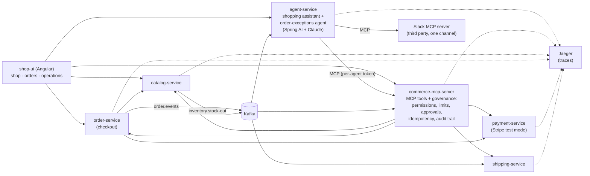

# spring-ai-agentic-commerce

**Governed AI agents on top of ordinary Spring Boot microservices**, built with Spring AI, Claude and the Model
Context Protocol (MCP).

An online outdoor shop, *Trailhead*, runs on plain microservices. Two AI agents work alongside them: a **shopping
assistant** that customers chat with, and an **order-exceptions agent** that steps in when an order can no longer be
fulfilled. Every action they take goes through MCP tools whose rules are **enforced in code**, and every step is
**traceable and auditable** afterwards.

## The idea in one paragraph

The normal path (browse, order, pay, ship) stays plain, fast, deterministic code. **No AI agent sits on the
checkout path.** Agents are used where judgment is needed: a customer asking for help, or stock running out after
an order was paid. They act only through MCP tools, and the MCP server is the policy enforcement point:

- each agent has its **own identity** (bearer token) and its **own tool allowlist**, checked on every call;
- a customer-facing agent can only touch **that customer's orders**, and the customer's identity is injected by
  code, never chosen by the model;
- refunds above **€100 wait for a human** to approve them;
- every refund carries an **idempotency key**, so a retrying agent can never pay out twice;
- an agent can **propose** an order but never place it: only the customer's own "Confirm and pay" does;
- each run has a **tool-call budget**, each agent has a **kill switch**, and when an agent fails or is switched off
  the work goes to a **human escalation queue**;
- every tool call, agent decision (with model and token usage), human decision and system event lands in one
  **audit trail**, linked to its **OpenTelemetry trace** in Jaeger.

## Architecture



| Service | Port | What it does |
|---|---|---|
| catalog-service | 8081 | Products and stock (on hand and reserved). A write-off below the reserved units publishes `inventory.stock-out`, naming the orders that can no longer be fulfilled. |
| order-service | 8082 | Checkout: reserves stock, saves the order, charges the card, publishes `order.events`. Cancellation releases the stock. |
| payment-service | 8083 | Card payments and idempotent refunds through Stripe test mode (or a built-in simulator without a key). Has a simulated-outage switch for the demo. |
| shipping-service | 8084 | Creates and cancels shipments from order events. |
| commerce-mcp-server | 8085 | Nine MCP tools over the services, plus the governance API: audit trail, refund approvals, order proposals, customer notifications, escalations. |
| agent-service | 8086 | The two agents, each with its own MCP connection, allowlist, prompt, effort level and kill switch. |
| shop-ui | 8080 | Angular app served by nginx, which routes `/svc/<service>/` to each service. |

### The MCP tools

| Tool | Shopping assistant | Order-exceptions agent |
|---|---|---|
| `search_products` | ✅ | |
| `find_customer_orders` | ✅ (own orders) | |
| `get_order` | ✅ (own orders) | ✅ |
| `track_shipment` | ✅ (own orders) | ✅ |
| `propose_order` | ✅ | |
| `cancel_order` | ✅ (own orders) | ✅ |
| `issue_refund` | ✅ (own orders, limit applies) | ✅ (limit applies) |
| `notify_customer` | | ✅ |
| `escalate_to_human` | ✅ | ✅ |
| Slack `conversations_add_message` | | ✅ (one channel) |

## The workflows

1. **Order through chat.** The customer asks the shopping assistant for a product. It searches the catalog and calls
   `propose_order`; the chat shows the proposal with a **Confirm and pay** button. Only that click places the order,
   reserves the stock and charges the card. A declined test card fails cleanly and releases the stock.
2. **Stock-out after ordering.** Operations writes off damaged stock. The catalog publishes a stock-out naming the
   newest order it can no longer cover. The order-exceptions agent wakes up, cancels the order, refunds it within its
   limit, notifies the customer, posts to Slack, and records its decision. The order's timeline shows every step.
3. **Refund above the limit.** The same stock-out on a €129.90 order: the refund is held as *pending approval*. A
   person approves or rejects it in the operations console; the decision is recorded, and the refund runs once.
4. **Payment service down.** With the simulated outage on, the agent's refund fails. It retries with the same
   idempotency key, then escalates to a human instead of guessing. Once payments are back, a person clicks **Retry
   refund**: it runs exactly once, with the same key.
5. **Kill switch.** Switch the order-exceptions agent off: the next stock-out goes straight to the escalation queue,
   without calling the model.
6. **Prompt injection.** Ask the assistant to cancel another customer's order. The customer's identity is injected
   by code and the MCP server checks ownership, so the attempt is refused and recorded as *denied*.

## Run it

You need Docker, Java 21, Maven and Node 22.22+ (or 24).

```bash
cp .env.example .env        # add your Anthropic API key; Stripe and Slack are optional
./start-demo.sh             # or ./start-demo.sh --slack
```

- Shop, orders and operations console: http://localhost:8080
- Traces: http://localhost:16686

Without a Stripe key, payments are simulated with Stripe's test-card conventions. Without an Anthropic key, the
services run but the agents hand everything to the escalation queue.

For development, start only the infrastructure (`docker compose up -d postgres kafka jaeger`), run the services
from your IDE or with `mvn spring-boot:run`, and the UI with `npm start` in `shop-ui`.

## Tests

```bash
mvn verify
```

Integration tests run each service against real Postgres and Kafka (Testcontainers). Service-to-service calls are
tested over real HTTP with WireMock. The MCP server is tested through a real MCP client, as the agents use it:
authentication, permissions, customer scoping, the approval limit, idempotent retries and the audit trail.

### Agent evals

The agents themselves are checked by `agent-evals`: six scenarios run against the whole running demo with the real
model, asserting on **what the agents did** (the audit trail, orders, payments and escalations), not on the wording
of their replies.

```bash
./start-demo.sh
mvn -pl agent-evals -Pevals test
```

They call Claude, so they are skipped in a normal build; a run costs a few cents. When the UI runs with `npm start`
instead of in Docker, point them at it with `-Devals.baseUrl=http://localhost:4200/svc`.

## Design decisions

- **Agents handle exceptions, not the happy path.** Checkout is deterministic code. An agent proposes orders; the
  customer confirms them.
- **Governance lives in the MCP server, not in prompts.** Prompts ask the agent to behave; the server makes sure it
  does: identity, permissions, ownership, limits, approvals and idempotency are all enforced in code.
- **Defence in depth.** The agent service only hands each agent its allowlisted tools; the MCP server checks the same
  permissions again on every call.
- **Deterministic work stays in code.** Which orders a stock-out affects is calculated by the catalog, not guessed by
  a model.
- **Fail safe, toward a human.** A failed or switched-off agent escalates; it never leaves an order in limbo.
- **Stock changes lock the product row,** so concurrent reservations and write-offs never reserve more than exists.
- **No database transaction is held open across remote calls.** Checkout saves the order before charging the card,
  and releases the stock if any step fails.
- **Events are published after commit,** so consumers never see a rolled-back change. The trade-off: an event can be
  lost if a process dies between commit and send. A transactional outbox closes that gap; it is left out to keep the
  demo small.
- **The demo UI has no login.** You pick which customer you are. In production the UI and the governance API would sit
  behind the organisation's identity provider.

## Stack

Java 21 · Spring Boot 4.1 · Spring AI 2.0 (Anthropic and MCP) · Claude (`claude-opus-5-5`) · MCP Java SDK 2.0 ·
PostgreSQL 17 · Apache Kafka 4.1 · Stripe (test mode) · OpenTelemetry + Jaeger · Angular 22 · Flyway ·
Testcontainers · WireMock
