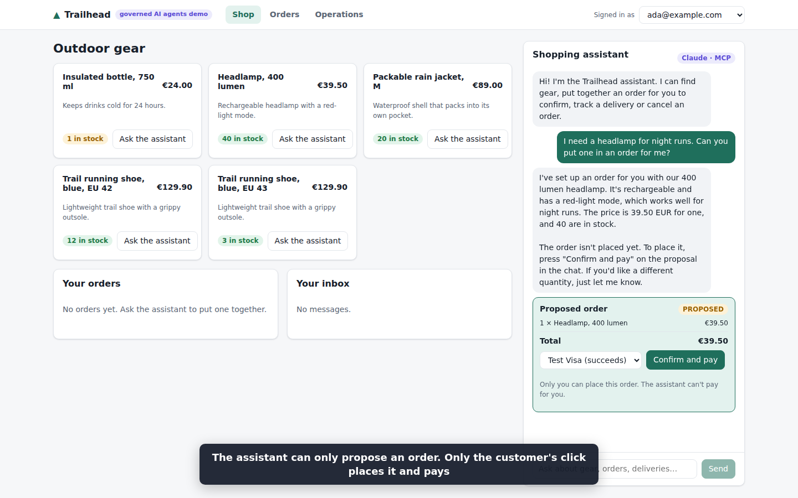
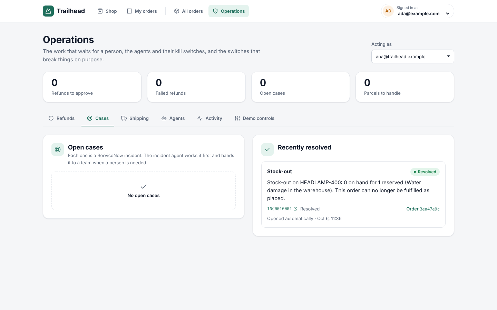
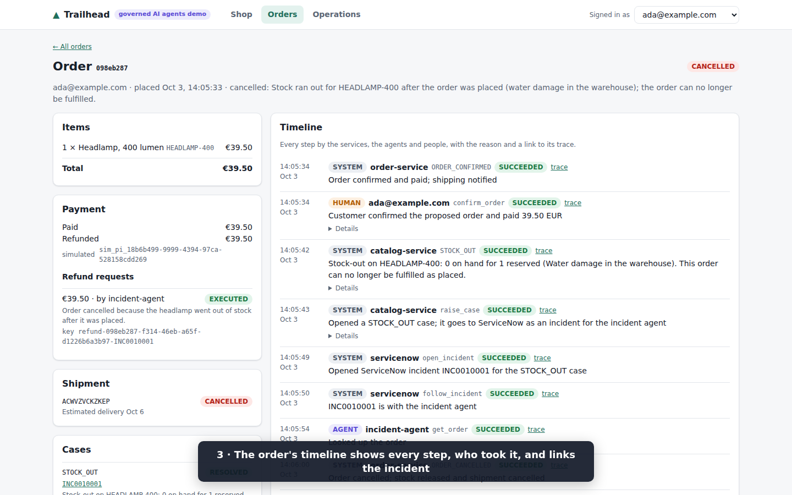
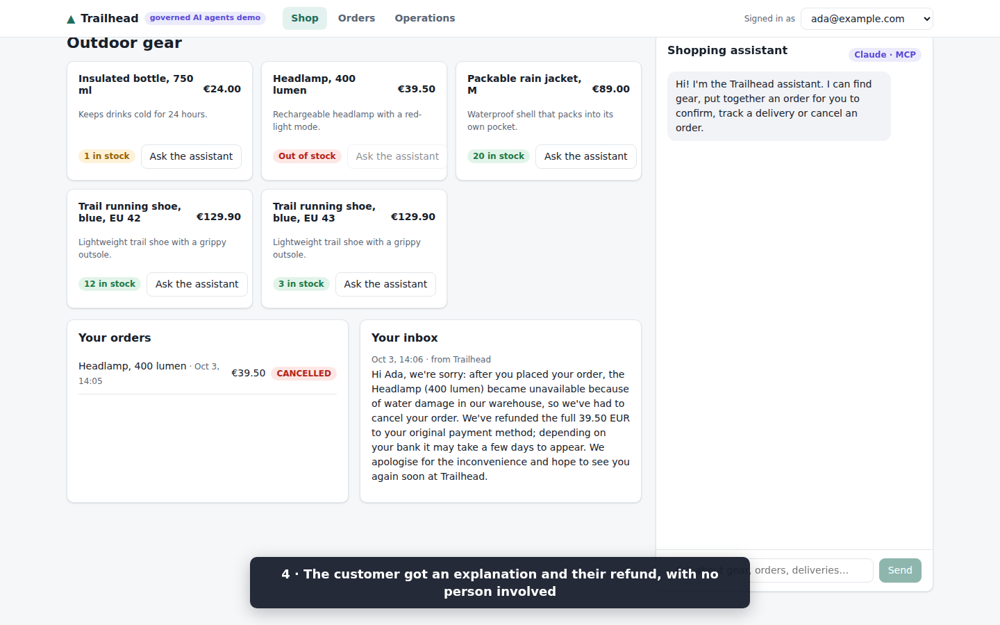
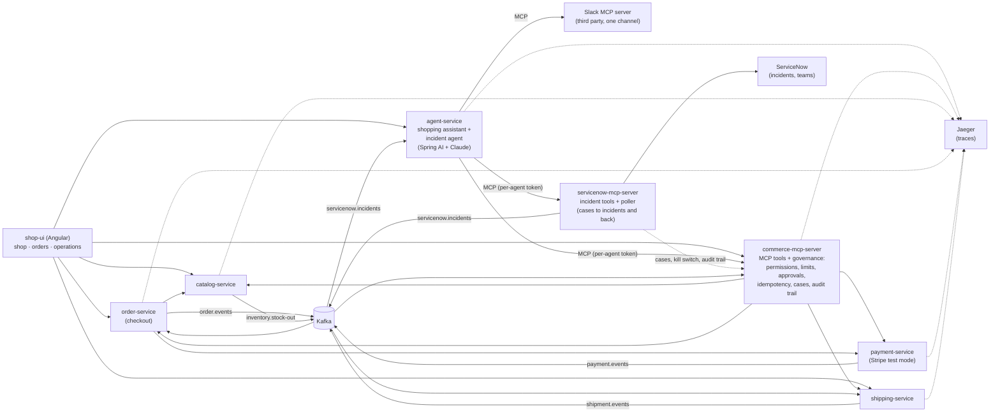

# spring-ai-agentic-commerce

**Governed AI agents on top of ordinary Spring Boot microservices**, built with Spring AI, Claude and the Model
Context Protocol (MCP).

An online outdoor shop, *Trailhead*, runs on plain microservices. Two AI agents work alongside them: a **shopping
assistant** that customers chat with, and an **incident agent** that works every problem first, from a stock-out to a
lost parcel, as a ServiceNow incident, and hands it to the right team when it cannot finish it. Every action they take goes through MCP tools whose rules are **enforced in code**, and every step is
**traceable and auditable** afterwards.

## Contents

- [See it in action](#see-it-in-action)
- [The idea in one paragraph](#the-idea-in-one-paragraph)
- [Architecture](#architecture)
- [The workflows](#the-workflows)
- [Get started](#get-started): prerequisites, first run, your first ten minutes
- [Configuration](#configuration)
- [ServiceNow incidents](#servicenow-incidents)
- [Stop, restart and reset](#stop-restart-and-reset)
- [Develop](#develop): run services from your IDE, project layout
- [Tests](#tests) and the [scenario suite](#scenario-suite)
- [Troubleshooting](#troubleshooting)
- [Design decisions](#design-decisions)
- [Stack](#stack)

## See it in action

A customer orders a headlamp through the shopping assistant; operations writes off the damaged stock; the incident
agent works the stock-out as a ServiceNow incident (cancels the order, refunds it, tells the customer) and resolves it.
Shown at double speed, recorded with the real model and the ServiceNow simulator.

[Watch the demo](https://github.com/user-attachments/assets/5c9297f2-6274-4166-9504-9167dcaa4c00)


| The assistant proposes, only the customer pays | The incident agent resolves the stock-out |
|---|---|
|  |  |
| **Every step on the order's timeline** | **The customer is told, and refunded** |
|  |  |

## The idea in one paragraph

The normal path (browse, order, pay, ship) stays plain, fast, deterministic code. **No AI agent sits on the
checkout path.** Agents are used where judgment is needed: a customer asking for help, or a problem with an order
after it was paid. They act only through MCP tools, and the MCP server is the policy enforcement point:

- each agent has its **own identity** (bearer token) and its **own tool allowlist**, checked on every call;
- a customer-facing agent can only touch **that customer's orders**, and the customer's identity is injected by
  code, never chosen by the model;
- refunds above **€100 wait for a human** to approve them;
- every refund carries an **idempotency key**, so a retrying agent can never pay out twice;
- an agent can **propose** an order but never place it: only the customer's own "Confirm and pay" does;
- every problem is a **case**, opened by code and worked as a **ServiceNow incident**: the incident agent works it
  first, and when it fails, is switched off or needs a person, the incident goes to a **team** in ServiceNow;
- each run has a **tool-call budget** and each agent has a **kill switch**;
- every tool call, agent decision (with model and token usage), human decision and system event lands in one
  **audit trail**, linked to its **OpenTelemetry trace** in Jaeger.

## Architecture



| Service | Port | What it does |
|---|---|---|
| catalog-service | 8081 | Products and stock (on hand and reserved). A write-off below the reserved units publishes `inventory.stock-out`, naming the orders that can no longer be fulfilled. A shipped order's units leave the stock. |
| order-service | 8082 | Checkout: reserves stock, saves the order, charges the card, publishes `order.events`. Ships an order once the catalog hands over its stock, and follows its parcel from `shipment.events`. Cancellation releases the stock. |
| payment-service | 8083 | Card payments and idempotent refunds through Stripe test mode (or a built-in simulator without a key). Publishes `payment.events` when a refund fails after it was made. Has a simulated-outage switch for the demo. |
| shipping-service | 8084 | Shipments from order events, and a simulated carrier: a shipped parcel is delivered, not delivered or lost, and each report is published on `shipment.events`. |
| commerce-mcp-server | 8085 | Nine MCP tools over the services, plus the governance API: audit trail, refund approvals, order proposals, customer notifications, cases. Opens a case for every stock-out, failed delivery, lost parcel, refund that failed at the processor, and hand-off. |
| servicenow-mcp-server | 8087 | Five MCP tools over ServiceNow incidents, governed like the commerce tools. Opens an incident for each case, claims new incidents for the incident agent, publishes `servicenow.incidents`, and reads back who has each case's incident. |
| agent-service | 8086 | The two agents, each with its own MCP connections, allowlist, prompt and effort level. |
| servicenow-simulator | 8088 | Only with `./start-demo.sh --simulator`: an in-memory stand-in for the part of ServiceNow's Table API the demo uses, for trying the cases and running the scenario suite without an instance. |
| shop-ui | 8080 | Angular app served by nginx, which routes `/svc/<service>/` to each service. |

Each agent is defined in one file (model, effort, tools, budget and prompt) that agent-service and the MCP servers
read; [AGENTS.md](AGENTS.md#the-demos-agents) lists them.

### The MCP tools

| Tool | Shopping assistant | Incident agent |
|---|---|---|
| `search_products` | ✅ | |
| `find_customer_orders` | ✅ (own orders) | ✅ |
| `get_order` | ✅ (own orders) | ✅ |
| `track_shipment` | ✅ (own orders) | ✅ |
| `propose_order` | ✅ | |
| `cancel_order` | ✅ (own orders) | ✅ (linked order) |
| `issue_refund` | ✅ (own orders, limit applies) | ✅ (linked order, limit applies) |
| `notify_customer` | | ✅ (linked order) |
| `escalate_to_human` (opens a case) | ✅ | |
| ServiceNow `get_incident`, `add_work_note`, `list_teams`, `resolve_incident` | | ✅ (incidents it is working) |
| ServiceNow `assign_to_team` | | ✅ (also when switched off) |
| Slack `conversations_add_message` | | ✅ (one channel) |

## The workflows

1. **Order through chat.** The customer asks the shopping assistant for a product. It searches the catalog and calls
   `propose_order`; the chat shows the proposal with a **Confirm and pay** button. Only that click places the order,
   reserves the stock and charges the card. A declined test card fails cleanly and releases the stock. If the
   payment service is down when the customer confirms, the proposal shows that the payment is being confirmed, and
   the order completes by itself once the payment service is back.
2. **Stock-out after ordering.** Operations writes off damaged stock. The catalog publishes a stock-out naming the
   newest order it can no longer cover, and the shop opens a `STOCK_OUT` case for it. The case becomes a ServiceNow
   incident in the agent's group; the incident agent claims it, cancels the order, refunds it within its limit,
   notifies the customer, posts to Slack, writes work notes and resolves the incident. The order's timeline shows every
   step, and its page links the incident.
3. **Refund above the limit.** The same stock-out on a €129.90 order: the refund is held as *pending approval*, and the
   agent hands the incident to Payments instead of resolving it. A person approves or rejects the refund in the
   operations console; the decision is recorded, and the refund runs once.
4. **Payment service down.** With the simulated outage on, the agent's refund fails. It retries with the same
   idempotency key, then assigns the incident to the Payments team instead of guessing. Once payments are back, any
   operator clicks **Retry refund** on the failed refund in the console: it runs exactly once, with the same key.
5. **Kill switch.** Switch the incident agent off: the next incident goes straight to a team in ServiceNow, without
   calling the model, even while agent-service is down. The switch is kept by the commerce MCP server, so it stays off after a restart, and both MCP
   servers refuse every tool call of a switched-off agent except handing the work to people.
6. **Prompt injection.** Ask the assistant to cancel another customer's order. The customer's identity is injected
   by code and the MCP server checks ownership, so the attempt is refused and recorded as *denied*.
7. **One case per problem, one owner at a time.** Code opens the cases: for a stock-out, a delivery that failed, a
   lost parcel, a refund that failed at the card processor after it was accepted, and when the shopping assistant
   hands something over with `escalate_to_human`. An open incident the service desk raises about an order, in any
   group, is recorded as a `SERVICE_DESK` case of that order. An order has at most one open case of each kind except
   `SERVICE_DESK`; the same problem raised again adds a work note to its incident. The incident agent works each case
   the shop opens first; a failed delivery goes to Fulfilment and a failed refund to Payments. The console's
   **Cases** card shows who has each incident now. An incident reopened after it was resolved opens its case again;
   if a newer case of the same kind is open by then, both are open, and the newer one still takes the problem raised
   again. While a team or a person has one of an order's incidents, agents leave the order's money to them: their
   refunds are refused. While any case of an order is open, the shopping assistant may not refund it either, and the
   incident agent refunds only for the incident it is working, while the order's other cases have not reached
   ServiceNow yet.
8. **Incident from the service desk.** The service desk raises an incident in the agent's assignment group, for
   example "Order arrived broken, the customer wants their money back", with the order's id in the incident's
   Correlation ID field. The shop records it as a `SERVICE_DESK` case of the order (see workflow 7). The incident
   agent claims it, reads it, checks the order, payment and shipment, refunds within its limit, tells the customer,
   writes what it found and did as work notes, and resolves the incident. When it cannot decide, it hands the
   incident to the team whose work it is (customer care, payments or fulfilment) with a note of what that team needs
   to do; ServiceNow notifies the team. It needs a ServiceNow instance; see "ServiceNow incidents" below.
9. **Shipping and delivery.** In the operations console, **Ship** sends a paid order: the catalog takes its units
   out of the warehouse and the order becomes *shipped*. From then on it can no longer be cancelled, by a person or an
   agent. An order that a stock-out left without stock cannot ship. Playing the carrier, an operator then reports the
   parcel *delivered*, *delivery failed* or *lost*; the order follows, and its timeline shows each step.
   `track_shipment` shows the agents where the parcel is and what went wrong.

## Get started

### Prerequisites

| You need | Version | Why |
|---|---|---|
| Docker with Compose v2 (Docker Desktop, or Docker Engine with the compose plugin) | recent | Runs Postgres, Kafka, Jaeger, the seven services and the UI. Give Docker at least **8 GB of memory**: up to eight Spring Boot services and Kafka run at once. |
| JDK | 21 | `start-demo.sh` builds the services with Maven on your machine before it builds the images. |
| Maven | 3.9 or newer | Builds the services. |
| Node.js and npm | Node 22.22 or newer, or 24 | `start-demo.sh` builds the Angular UI on your machine. |
| An Anthropic API key | | For the agents (console.anthropic.com). Optional: without one everything else runs, and the incident agent hands every incident to a team. |

Optional extras: a Stripe **test-mode** key (payments are simulated without one), a ServiceNow developer instance (the
built-in simulator stands in for it), and a Slack bot token (the incident agent then also posts to a channel).

Ports 8080 to 8088, 5432, 9092, 16686 and 4318 must be free.

### First run

```bash
git clone https://github.com/exepex/spring-ai-agentic-commerce.git
cd spring-ai-agentic-commerce
cp .env.example .env              # then open .env and set AGENTIC_COMMERCE_ANTHROPIC_API_KEY
./start-demo.sh --simulator       # builds everything and starts the demo with the ServiceNow simulator
```

`start-demo.sh` builds the services (`mvn package`), builds the UI (`npm ci` and `npm run build` in `shop-ui`) and
starts everything with `docker compose up -d --build`. The first build downloads dependencies and images and takes a
few minutes; later starts are much faster. When it finishes, give the services about a minute to start, then open:

- **http://localhost:8080**: the shop, the customer's orders and the operations console;
- **http://localhost:16686**: Jaeger, with the trace of every request and agent run.

`docker compose ps` shows what is running; `docker compose logs -f agent-service` follows one service's log.

Options: `--simulator` works the cases in the built-in ServiceNow stand-in (recommended for a first run; without it,
and without a ServiceNow instance in `.env`, cases wait as *pending*); `--slack` also starts the Slack MCP server for
the channel in `.env`. Both can be combined.

### Your first ten minutes

The UI has no login: pick a customer (`ada@example.com`, `grace@example.com` or `alan@example.com`) in the header.
The shop sells five seeded products, from a €24.00 bottle to €129.90 trail shoes.

1. **Order through chat.** On **Shop**, ask the shopping assistant: *"I need a headlamp for night hikes."* It
   searches the catalog and proposes an order. Click **Confirm and pay**: the order is placed and paid (the test card
   is accepted). **Orders** lists it; open it to see its timeline.
2. **Cause a stock-out.** On **Operations**, under **Write off damaged stock**, write off enough headlamps that fewer
   remain than are reserved. The catalog announces the stock-out and the shop opens a `STOCK_OUT` case; the **Cases**
   card shows it go to ServiceNow and to the incident agent.
3. **Watch the incident agent work.** Within about half a minute the agent claims the incident, cancels the order,
   refunds it, tells the customer (see **Your inbox** on **Shop**) and resolves the incident. Open the order: its
   **Timeline** shows every system, agent and human step, each linked to its trace in Jaeger.
4. **Hit the refund limit.** Repeat with the €129.90 trail shoes: the refund is above the €100 limit, so it waits under
   **Refunds waiting for approval** and the incident goes to the Payments team. Approve or reject it yourself.
5. **Break things on purpose.** Under **Demo controls**, switch on the payment-service outage, or switch an agent off
   under **Agents**, and repeat a stock-out: the agent retries with the same idempotency key and hands over, or the
   incident goes straight to a team. Ask the assistant to cancel another customer's order: it is refused and recorded
   as *denied* under **Activity**.

The [workflows](#the-workflows) above describe each of these, and more, in detail.

## Configuration

Everything is set in `.env` (copied from `.env.example`); Docker Compose passes it to the services. Never commit
`.env`.

| Variable | Required | What it does |
|---|---|---|
| `AGENTIC_COMMERCE_ANTHROPIC_API_KEY` | for the agents | Claude API key. Without it the services run, but the agents cannot answer and incidents go to a team. |
| `AGENTIC_COMMERCE_STRIPE_SECRET_KEY` | no | A Stripe test-mode key (`sk_test_...`). Without it, payments are simulated with Stripe's test-card conventions; a live key is refused. |
| `AGENTIC_COMMERCE_SERVICENOW_INSTANCE_URL`, `_USERNAME`, `_PASSWORD` | no | The ServiceNow instance and integration user, see [ServiceNow incidents](#servicenow-incidents). `--simulator` overrides them. |
| `AGENTIC_COMMERCE_SERVICENOW_AGENT_GROUP`, `_CUSTOMER_CARE_GROUP`, `_PAYMENTS_GROUP`, `_FULFILMENT_GROUP` | no | Assignment group names, if yours differ from `Online Shop Agent`, `Customer Care`, `Payments` and `Fulfilment`. |
| `AGENTIC_COMMERCE_SLACK_BOT_TOKEN`, `AGENTIC_COMMERCE_SLACK_CHANNEL_ID` | no | Slack bot and channel for `--slack`; the scopes are listed in `.env.example`. |
| `AGENTIC_COMMERCE_SHOPPING_ASSISTANT_TOKEN`, `AGENTIC_COMMERCE_INCIDENT_AGENT_TOKEN` | yes (defaults in `.env.example`) | Each agent's bearer token, shared by agent-service and the MCP servers. Change them for anything beyond a local demo. |
| `AGENTIC_COMMERCE_INTERNAL_API_TOKEN` | yes (default in `.env.example`) | The token services present to each other's internal endpoints: placing and cancelling orders, charging, refunding, reserving stock. Without it nobody can call them directly, so the refund approval limit cannot be bypassed. Change it for anything beyond a local demo. |
| `AGENTIC_COMMERCE_SLACK_MCP_API_KEY` | with `--slack` | The key agent-service presents to the Slack MCP server. |

Behaviour that is not a secret lives in each service's `src/main/resources/application.yml`, for example the refund
approval limit (`commerce.governance.refund-approval-threshold` in commerce-mcp-server) and the reconciliation
intervals. Each agent's model, effort, tools, tool-call budget and prompt live in one file per agent, listed in
[AGENTS.md](AGENTS.md#the-demos-agents).

## ServiceNow incidents

Every case is worked as a ServiceNow incident, so the incident agent needs a ServiceNow instance; a free developer
instance (developer.servicenow.com) works. Without one, cases wait as *pending* in the operations console, unless the
demo runs with the simulator: `./start-demo.sh --simulator` works the cases in a built-in stand-in for ServiceNow, with
the agent's group and the three teams already set up. It has no screens of its own and forgets its incidents when it
restarts. To use a real instance:

1. Create the assignment groups: one for the agent (`Online Shop Agent`) and one per team (`Customer Care`,
   `Payments`, `Fulfilment`). Add people to the team groups; ServiceNow notifies a group when an incident is assigned
   to it.
2. Create an integration user for the agent with the `itil` role, and add it to the `Online Shop Agent` group.
3. Set `AGENTIC_COMMERCE_SERVICENOW_INSTANCE_URL`, `_USERNAME` and `_PASSWORD` in `.env` to that instance and user.
   Other group names can be set with the variables in `servicenow-mcp-server`'s `application.yml`.

The shop's own cases arrive in the `Online Shop Agent` group by themselves. To raise one as the service desk, create an
incident in that group with the order's id in its Correlation ID field. Within half a minute the agent claims it. The agent may cancel, refund or notify the customer about that order only; an incident
without one, or about another order, is investigated and handed to a team.

## Stop, restart and reset

```bash
docker compose --profile simulator --profile slack stop      # stop everything, keep the data
docker compose --profile simulator --profile slack start     # start it again
docker compose --profile simulator --profile slack down -v   # remove the containers and wipe the database
```

Name the profiles you started with, so their services are included. After `down -v` the next start creates the
databases again with the seeded products and stock. To rebuild after a code change, run `./start-demo.sh` again.

## Develop

For development, start only the infrastructure (`docker compose up -d postgres kafka jaeger`), run the services from
your IDE or with `mvn spring-boot:run` in a service's folder, and the UI with `npm start` in `shop-ui`
(http://localhost:4200). To work ServiceNow incidents this way, also run servicenow-mcp-server and start agent-service
with `AGENTIC_COMMERCE_SERVICENOW_MCP_URL=http://localhost:8087`.

### Project layout

| Folder | What is in it |
|---|---|
| `agent-definitions` | The two agents' definition files (model, effort, tools, budget, prompt) and the code that reads them. |
| `commerce-platform` | What every service shares, configured automatically: one base exception and one handler that answers it as a problem detail, publishing events to Kafka after commit, log safety, bearer tokens, reading another service's error answer, the clock, and the tracing defaults. |
| `mcp-server-support` | What both MCP servers share: agent authentication (tokens, the filter, the agent in each tool call) and the governed tool call (allowlist, kill switch, run, audit). Each server plugs in its own kill switch, refusals and audit trail. |
| `governance-api` | The contract of the commerce MCP server's agent API, and the client agent-service and the ServiceNow MCP server call it with. |
| `agent-service` | Runs the agents with Spring AI: the chat endpoint, the incident listener, MCP connections and per-call guards. |
| `commerce-mcp-server` | The commerce MCP tools and the governance API: permissions, limits, approvals, cases, audit trail, kill switches. |
| `servicenow-mcp-server` | The ServiceNow MCP tools and the poller that keeps cases and incidents in step; ServiceNow's Table API sits behind one `IncidentSystem` interface. |
| `servicenow-simulator` | The in-memory ServiceNow stand-in used by `--simulator` and the scenario suite. |
| `catalog-service`, `order-service`, `payment-service`, `shipping-service` | The shop's ordinary microservices. |
| `agent-evals` | The scenario suite that runs the workflows against the whole demo with the real model. |
| `shop-ui` | The Angular shop, orders and operations console. |
| `docker`, `docker-compose.yml`, `start-demo.sh`, `run-scenarios.sh` | How the demo is built and started. |

The shared modules hold only what every service needs in the same way; a service's own rules stay in the service.
They are plain libraries with Spring Boot auto-configuration: adding one as a dependency is all it takes.

Inside a service, the code is organised the same way: the domain, its services, controllers and repositories in the
service's package, and next to them

- `constants`: every fixed text and name the service uses (API paths, configuration keys, error messages, the names
  and codes of the systems it talks to), so they can be reviewed in one place;
- `dto`: the records that go over the wire (request and response bodies, MCP tool parameters, payloads of the
  services it calls); commerce-mcp-server keeps one `dto` package per feature (`cases`, `governance`, `tools`,
  `downstream`);
- `exception`: one exception per thing that can go wrong (for example `PaymentNotFoundException`,
  `RefundExceedsPaymentException`, `CustomerScopeViolationException`). Each extends the platform's
  `CommerceException`, so the platform's one handler answers it as an RFC 9457 problem detail with its status,
  message and any extra facts. An exception thrown inside an MCP tool is not an HTTP response: its message goes back
  to the model as the tool's error. The simulator stands in for ServiceNow and answers in ServiceNow's own error
  format, so it keeps its own handler and none of the shared modules.

## Tests

```bash
mvn verify
```

Integration tests run each service against real Postgres and Kafka (Testcontainers). Service-to-service calls are
tested over real HTTP with WireMock. The MCP server is tested through a real MCP client, as the agents use it:
authentication, permissions, customer scoping, the approval limit, idempotent retries and the audit trail.

### Scenario suite

The workflows are checked end to end by `agent-evals`: ten scenarios run against the whole running demo with the real
model, asserting on **what the agents did** (the audit trail, orders, payments and cases), not on the wording of their
replies. They cover stock-outs within and above the refund limit, a stock-out delivered twice, payments down, the kill
switch, the shopping assistant, a failed delivery, a lost parcel, and an incident the service desk raises. They play
the carrier through the shop, and the service desk and the teams through ServiceNow's Table API. Each scenario puts
back the stock it uses, so the suite can run again and again on the same database.

```bash
./run-scenarios.sh          # starts the demo with the ServiceNow simulator, then runs the suite
./run-scenarios.sh --live   # the same against the ServiceNow instance in .env
```

They call Claude, so they are skipped in a normal build; a run costs some model usage. Against a demo that is already
running, use `mvn -pl agent-evals -Pevals test`. Point them at a UI run with `npm start` with
`-Devals.baseUrl=http://localhost:4200/svc`, and at ServiceNow with `-Devals.servicenow.url`, `.username`,
`.password` and `.agent-group` (by default the `AGENTIC_COMMERCE_SERVICENOW_*` variables, or the simulator).

## Troubleshooting

| Symptom | What to check |
|---|---|
| `start-demo.sh` fails in `mvn package` | `java -version` must show 21 and `mvn -v` 3.9 or newer. |
| `start-demo.sh` fails in `npm ci` | `node -v` must be 22.22 or newer, or 24. |
| A container exits or restarts | `docker compose logs <service>`. Most often Docker has too little memory: give it 8 GB. A port already in use shows as a bind error. |
| The shopping assistant does not answer | `AGENTIC_COMMERCE_ANTHROPIC_API_KEY` in `.env`, then restart with `./start-demo.sh`. `docker compose logs agent-service` shows the error. |
| Cases stay *pending* | No ServiceNow is configured: start with `--simulator`, or set the instance in `.env`. |
| Every payment fails with 503 | The simulated outage is on: switch it off under **Demo controls**. |
| An incident went straight to a team | The incident agent is switched off under **Agents**, or it has no API key. |
| `mvn verify` fails at Testcontainers | The integration tests need a running Docker daemon. |

## Design decisions

- **Agents handle exceptions, not the happy path.** Checkout is deterministic code. An agent proposes orders; the
  customer confirms them.
- **Governance lives in the MCP server, not in prompts.** Prompts ask the agent to behave; the server makes sure it
  does: identity, permissions, ownership, limits, approvals and idempotency are all enforced in code.
- **Defence in depth.** The agent service only hands each agent its allowlisted tools; the MCP server checks the same
  permissions again on every call.
- **Only services call the internal endpoints.** Placing and cancelling orders, charging, refunding and reserving stock
  need the service token (`commerce.internal-api` in each service's `application.yml`, built once in
  `commerce-platform`). The browser reaches the services through nginx, but cannot call these, so a refund always goes
  through the MCP server's approval limit and an order is only placed from a confirmed proposal.
- **Deterministic work stays in code.** Which orders a stock-out affects is calculated by the catalog, not guessed by
  a model.
- **ServiceNow is the one case system.** Every problem is a case, opened by code rather than by a model's judgement,
  and worked as a ServiceNow incident: the incident agent first, then a team when a person is needed. Handing work to
  people means assigning the incident to a team, where the service desk already works; the shop keeps no queue of its
  own. Refund approvals stay in the operations console, because the approval limit is a rule of the shop's MCP server.
- **Fail safe, toward a human.** A failed or switched-off agent hands its incident to a team; it never leaves an
  order in limbo. The incident agent's incidents always end with an owner: resolved by the agent, or assigned to a team, by the agent, by
  code when its run fails or ends without either, or by the poller when a claimed incident is not finished in time.
- **The agent only changes what it owns.** Every ServiceNow tool works only on an incident assigned to the agent's
  integration user, so it cannot touch incidents that a person or another team owns. An incident run may change only
  the order linked in the incident's Correlation ID, and only while the incident is still the agent's, so text in the
  incident cannot steer it to another order and a person who takes the incident over stops it. The
  Table API has no conditional update, so the poller reads an incident again right before claiming or handing it
  over; a person who takes it in the moment between that read and the update is overwritten.
- **One service decides between shipping and cancelling.** Shipping goes through the order service, which marks an
  order shipped only while it is still confirmed, the same check a cancellation makes, so an order is never both. The
  catalog hands over the stock just before; if the order is cancelled at that moment, the cancellation's stock release
  puts the units back on the shelf.
- **Stock changes lock the product row,** so concurrent reservations and write-offs never reserve more than exists.
- **No database transaction is held open across remote calls.** Checkout saves the order before charging the card,
  and releases the stock if any step fails.
- **Unfinished work is finished later, never guessed.** When a payment's outcome is unknown (the payment service is
  down or times out), the order waits as `PAYMENT_PENDING` with its stock kept, and the payment is asked for again
  until it succeeds or is declined. Stock to give back is recorded with the order change that needs it and released
  once the catalog answers. A confirmed proposal places its order under the proposal's id, so placing it again never
  places a second order. Refunds are checked with the card processor again; one that fails afterwards no longer
  counts as refunded, its refund request is marked failed, and a case is opened for the order. Each service runs its own reconciler for this; the intervals are under `commerce.reconciliation`
  and `commerce.payments.refund-check` in each service's `application.yml`.
- **Events go through a transactional outbox.** A service writes each event into an `outbox_event` table of its own
  schema, in the same transaction as the change it announces, so an event exists exactly when its change committed,
  even if the process dies right after. A relay in the shared `commerce-platform` module puts the events on Kafka,
  oldest first, as soon as the transaction commits, and deletes each one Kafka took; one that Kafka does not take is
  sent again, so consumers may see an event twice but never miss one. One instance of a service relays at a time (a
  Postgres advisory lock), so an order's events leave in order however many instances run. The event carries the
  trace it was raised in, so the consumer's work still joins the request's trace in Jaeger.
- **Events can arrive twice, and that is harmless.** The audit trail records each event once per order, and opens its
  case once per order, by the id its service gave it. A case's incident carries the case id in its Correlation display
  field, so a poller that stopped after creating it finds it again instead of opening a second one. An incident
  delivered to the agent again is worked again: the agent checks which steps are already done (`get_order` shows each
  refund's idempotency key and status, and when the customer was notified) and does only the others. Its refund and
  its message to the customer each carry a key made of the order and the incident, so the refund pays out once and the
  customer is told once; code sets the message's key, not the model. Nothing records whether the
  Slack line was posted, so it may be posted twice, but is never missed.
- **The demo UI has no login.** You pick which customer you are. In production the UI and the governance API would sit
  behind the organisation's identity provider.

## Stack

Java 21 · Spring Boot 4.1 · Spring AI 2.0 (Anthropic and MCP) · Claude (`claude-opus-5-5`) · MCP Java SDK 2.0 ·
PostgreSQL 17 · Apache Kafka 4.1 · Stripe (test mode) · OpenTelemetry + Jaeger · Angular 22 · Flyway ·
Testcontainers · WireMock
