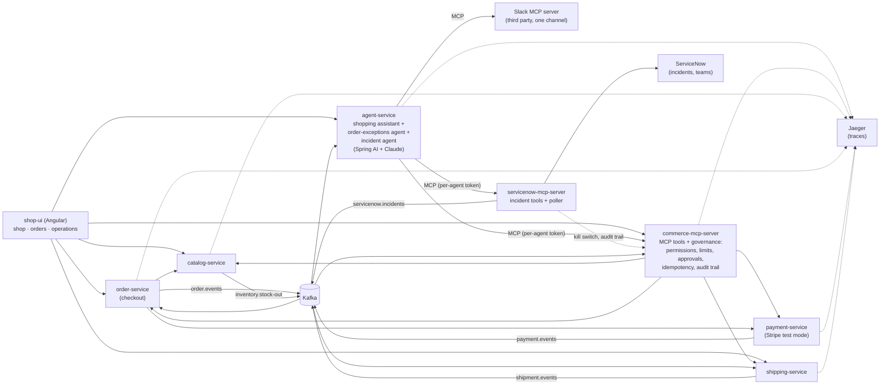

# spring-ai-agentic-commerce

**Governed AI agents on top of ordinary Spring Boot microservices**, built with Spring AI, Claude and the Model
Context Protocol (MCP).

An online outdoor shop, *Trailhead*, runs on plain microservices. Three AI agents work alongside them: a **shopping
assistant** that customers chat with, an **order-exceptions agent** that steps in when an order can no longer be
fulfilled, and an **incident agent** that works ServiceNow incidents first and hands them to the right team when it
cannot finish them. Every action they take goes through MCP tools whose rules are **enforced in code**, and every step is
**traceable and auditable** afterwards.

## The idea in one paragraph

The normal path (browse, order, pay, ship) stays plain, fast, deterministic code. **No AI agent sits on the
checkout path.** Agents are used where judgment is needed: a customer asking for help, or stock running out after
an order was paid. They act only through MCP tools, and the MCP server is the policy enforcement point:

- each agent has its **own identity** (bearer token) and its **own tool allowlist**, checked on every call;
- a customer-facing agent can only touch **that customer's orders**, and the customer's identity is injected by
  code, never chosen by the model;
- refunds above **€100 wait for a human** to approve them;
- every refund carries an **idempotency key**, so a retrying agent can never pay out twice;
- an agent can **propose** an order but never place it: only the customer's own "Confirm and pay" does;
- each run has a **tool-call budget**, each agent has a **kill switch**, and when an agent fails or is switched off
  the work goes to a **human escalation queue**;
- every tool call, agent decision (with model and token usage), human decision and system event lands in one
  **audit trail**, linked to its **OpenTelemetry trace** in Jaeger.

## Architecture



| Service | Port | What it does |
|---|---|---|
| catalog-service | 8081 | Products and stock (on hand and reserved). A write-off below the reserved units publishes `inventory.stock-out`, naming the orders that can no longer be fulfilled. A shipped order's units leave the stock. |
| order-service | 8082 | Checkout: reserves stock, saves the order, charges the card, publishes `order.events`. Ships an order once the catalog hands over its stock, and follows its parcel from `shipment.events`. Cancellation releases the stock. |
| payment-service | 8083 | Card payments and idempotent refunds through Stripe test mode (or a built-in simulator without a key). Publishes `payment.events` when a refund fails after it was made. Has a simulated-outage switch for the demo. |
| shipping-service | 8084 | Shipments from order events, and a simulated carrier: a shipped parcel is delivered, not delivered or lost, and each report is published on `shipment.events`. |
| commerce-mcp-server | 8085 | Nine MCP tools over the services, plus the governance API: audit trail, refund approvals, order proposals, customer notifications, escalations. |
| servicenow-mcp-server | 8087 | Five MCP tools over ServiceNow incidents, governed like the commerce tools. Claims new incidents for the incident agent and publishes `servicenow.incidents`. |
| agent-service | 8086 | The three agents, each with its own MCP connections, allowlist, prompt and effort level. |
| shop-ui | 8080 | Angular app served by nginx, which routes `/svc/<service>/` to each service. |

Each agent is defined in one file (model, effort, tools, budget and prompt) that agent-service and the MCP servers
read; [AGENTS.md](AGENTS.md#the-demos-agents) lists them.

### The MCP tools

| Tool | Shopping assistant | Order-exceptions agent | Incident agent |
|---|---|---|---|
| `search_products` | ✅ | | |
| `find_customer_orders` | ✅ (own orders) | | ✅ |
| `get_order` | ✅ (own orders) | ✅ | ✅ |
| `track_shipment` | ✅ (own orders) | ✅ | ✅ |
| `propose_order` | ✅ | | |
| `cancel_order` | ✅ (own orders) | ✅ | ✅ (linked order) |
| `issue_refund` | ✅ (own orders, limit applies) | ✅ (limit applies) | ✅ (linked order, limit applies) |
| `notify_customer` | | ✅ | ✅ (linked order) |
| `escalate_to_human` | ✅ | ✅ | |
| ServiceNow `get_incident`, `add_work_note`, `list_teams`, `resolve_incident` | | | ✅ (incidents it is working) |
| ServiceNow `assign_to_team` | | | ✅ (also when switched off) |
| Slack `conversations_add_message` | | ✅ (one channel) | ✅ (one channel) |

## The workflows

1. **Order through chat.** The customer asks the shopping assistant for a product. It searches the catalog and calls
   `propose_order`; the chat shows the proposal with a **Confirm and pay** button. Only that click places the order,
   reserves the stock and charges the card. A declined test card fails cleanly and releases the stock. If the
   payment service is down when the customer confirms, the proposal shows that the payment is being confirmed, and
   the order completes by itself once the payment service is back.
2. **Stock-out after ordering.** Operations writes off damaged stock. The catalog publishes a stock-out naming the
   newest order it can no longer cover. The order-exceptions agent wakes up, cancels the order, refunds it within its
   limit, notifies the customer, posts to Slack, and records its decision. The order's timeline shows every step.
3. **Refund above the limit.** The same stock-out on a €129.90 order: the refund is held as *pending approval*. A
   person approves or rejects it in the operations console; the decision is recorded, and the refund runs once.
4. **Payment service down.** With the simulated outage on, the agent's refund fails. It retries with the same
   idempotency key, then escalates to a human instead of guessing. Once payments are back, a person takes the
   escalation with **Assign to me** and clicks **Retry refund**: it runs exactly once, with the same key.
5. **Kill switch.** Switch the order-exceptions agent off: the next stock-out goes straight to the escalation queue,
   without calling the model. The switch is kept by the MCP server, so it stays off after a restart, and the server
   refuses every tool call of a switched-off agent except handing the work to a human.
6. **Prompt injection.** Ask the assistant to cancel another customer's order. The customer's identity is injected
   by code and the MCP server checks ownership, so the attempt is refused and recorded as *denied*.
7. **One person per escalation.** An escalation is open until someone assigns it to themselves; from then on only
   they can retry its refund, resolve it, or hand it back to the queue. Switch the operator at the top of the
   operations console: if two people try to take the same escalation, only one gets it and the other is told who
   has it. An order has at most one open escalation, and once it is with a person, agents leave its failed refund to
   them.
8. **Incident from ServiceNow.** The service desk raises an incident in the agent's assignment group, for example
   "Order arrived broken, the customer wants their money back", with the order's id in the incident's Correlation ID
   field. The incident agent claims it, reads it, checks
   the order, payment and shipment, refunds within its limit, tells the customer, writes what it found and did as
   work notes, and resolves the incident. When it cannot decide, it hands the incident to the team whose work it is
   (customer care, payments or fulfilment) with a note of what that team needs to do; ServiceNow notifies the team.
   It needs a ServiceNow instance; see "ServiceNow incidents" below.
9. **Shipping and delivery.** In the operations console, **Ship** sends a paid order: the catalog takes its units
   out of the warehouse and the order becomes *shipped*. From then on it can no longer be cancelled, by a person or an
   agent. An order that a stock-out left without stock cannot ship. Playing the carrier, an operator then reports the
   parcel *delivered*, *delivery failed* or *lost*; the order follows, and its timeline shows each step.
   `track_shipment` shows the agents where the parcel is and what went wrong.

## Run it

You need Docker, Java 21, Maven and Node 22.22+ (or 24).

```bash
cp .env.example .env        # add your Anthropic API key; Stripe and Slack are optional
./start-demo.sh             # or ./start-demo.sh --slack
```

- Shop, orders and operations console: http://localhost:8080
- Traces: http://localhost:16686

Without a Stripe key, payments are simulated with Stripe's test-card conventions. Without an Anthropic key, the
services run but the agents hand everything to the escalation queue.

### ServiceNow incidents

The incident agent needs a ServiceNow instance; a free developer instance (developer.servicenow.com) works. In it:

1. Create the assignment groups: one for the agent (`Online Shop Agent`) and one per team (`Customer Care`,
   `Payments`, `Fulfilment`). Add people to the team groups; ServiceNow notifies a group when an incident is assigned
   to it.
2. Create an integration user for the agent with the `itil` role, and add it to the `Online Shop Agent` group.
3. Set `AGENTIC_COMMERCE_SERVICENOW_INSTANCE_URL`, `_USERNAME` and `_PASSWORD` in `.env` to that instance and user.
   Other group names can be set with the variables in `servicenow-mcp-server`'s `application.yml`.

Then raise an incident in the `Online Shop Agent` group, with the order's id in its Correlation ID field. Within half
a minute the agent claims it. The agent may cancel, refund or notify the customer about that order only; an incident
without one, or about another order, is investigated and handed to a team.

For development, start only the infrastructure (`docker compose up -d postgres kafka jaeger`), run the services
from your IDE or with `mvn spring-boot:run`, and the UI with `npm start` in `shop-ui`. To work ServiceNow incidents
this way, also run servicenow-mcp-server and start agent-service with
`AGENTIC_COMMERCE_SERVICENOW_MCP_URL=http://localhost:8087`.

## Tests

```bash
mvn verify
```

Integration tests run each service against real Postgres and Kafka (Testcontainers). Service-to-service calls are
tested over real HTTP with WireMock. The MCP server is tested through a real MCP client, as the agents use it:
authentication, permissions, customer scoping, the approval limit, idempotent retries and the audit trail.

### Agent evals

The agents themselves are checked by `agent-evals`: seven scenarios run against the whole running demo with the real
model, asserting on **what the agents did** (the audit trail, orders, payments and escalations), not on the wording
of their replies.

```bash
./start-demo.sh
mvn -pl agent-evals -Pevals test
```

They call Claude, so they are skipped in a normal build; a run costs a few cents. When the UI runs with `npm start`
instead of in Docker, point them at it with `-Devals.baseUrl=http://localhost:4200/svc`.

## Design decisions

- **Agents handle exceptions, not the happy path.** Checkout is deterministic code. An agent proposes orders; the
  customer confirms them.
- **Governance lives in the MCP server, not in prompts.** Prompts ask the agent to behave; the server makes sure it
  does: identity, permissions, ownership, limits, approvals and idempotency are all enforced in code.
- **Defence in depth.** The agent service only hands each agent its allowlisted tools; the MCP server checks the same
  permissions again on every call.
- **Deterministic work stays in code.** Which orders a stock-out affects is calculated by the catalog, not guessed by
  a model.
- **Fail safe, toward a human.** A failed or switched-off agent escalates; it never leaves an order in limbo. The
  incident agent's incidents always end with an owner: resolved by the agent, or assigned to a team, by the agent, by
  code when its run fails or ends without either, or by the poller when a claimed incident is not finished in time.
- **The agent only changes what it owns.** Every ServiceNow tool works only on an incident assigned to the agent's
  integration user, so it cannot touch incidents that a person or another team owns. An incident run may change only
  the order linked in the incident's Correlation ID, and only while the incident is still the agent's, so text in the
  incident cannot steer it to another order and a person who takes the incident over stops it. The
  Table API has no conditional update, so the poller reads an incident again right before claiming or handing it
  over; a person who takes it in the moment between that read and the update is overwritten.
- **One service decides between shipping and cancelling.** Shipping goes through the order service, which marks an
  order shipped only while it is still confirmed, the same check a cancellation makes, so an order is never both. The
  catalog hands over the stock just before; if the order is cancelled at that moment, the cancellation's stock release
  puts the units back on the shelf.
- **Stock changes lock the product row,** so concurrent reservations and write-offs never reserve more than exists.
- **No database transaction is held open across remote calls.** Checkout saves the order before charging the card,
  and releases the stock if any step fails.
- **Unfinished work is finished later, never guessed.** When a payment's outcome is unknown (the payment service is
  down or times out), the order waits as `PAYMENT_PENDING` with its stock kept, and the payment is asked for again
  until it succeeds or is declined. Stock to give back is recorded with the order change that needs it and released
  once the catalog answers. A confirmed proposal places its order under the proposal's id, so placing it again never
  places a second order. Refunds are checked with the card processor again; one that fails afterwards no longer
  counts as refunded, its refund request is marked failed, and the order is handed to a person. Each service runs its own reconciler for this; the intervals are under `commerce.reconciliation`
  and `commerce.payments.refund-check` in each service's `application.yml`.
- **Events are published after commit,** so consumers never see a rolled-back change. The trade-off: an event can be
  lost if a process dies between commit and send. A transactional outbox closes that gap; it is left out to keep the
  demo small.
- **Events can arrive twice, and that is harmless.** The audit trail records each event once per order, by the id its
  service gave it. agent-service reads stock-outs from the start of the topic when it first joins, so none published
  before it started is missed. On a stock-out delivered again, the agent checks which steps are already done
  (`get_order` shows each refund's idempotency key and status, and when the customer was notified) and does only the
  others. A stock-out refund that failed is retried with its key even when nothing seems left to refund, and a
  refund already waiting for approval counts as returned. Nothing records whether the Slack line was posted, so it is
  posted again: the operations channel may see an order twice, but never misses one.
- **The demo UI has no login.** You pick which customer you are. In production the UI and the governance API would sit
  behind the organisation's identity provider.

## Stack

Java 21 · Spring Boot 4.1 · Spring AI 2.0 (Anthropic and MCP) · Claude (`claude-opus-5-5`) · MCP Java SDK 2.0 ·
PostgreSQL 17 · Apache Kafka 4.1 · Stripe (test mode) · OpenTelemetry + Jaeger · Angular 22 · Flyway ·
Testcontainers · WireMock
