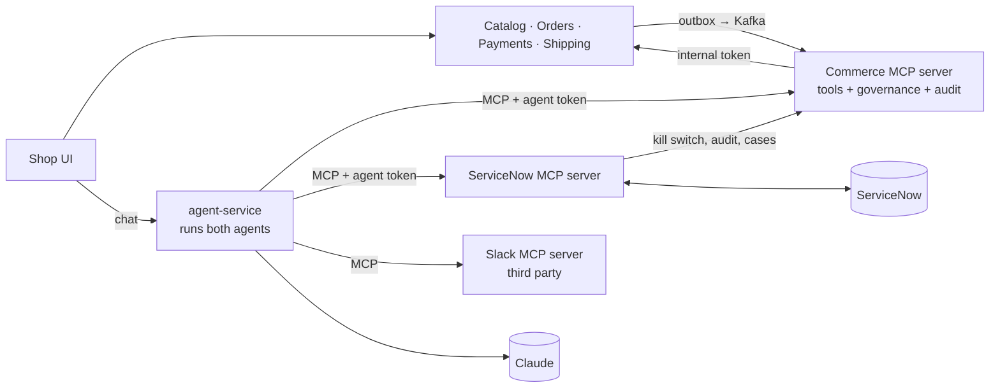
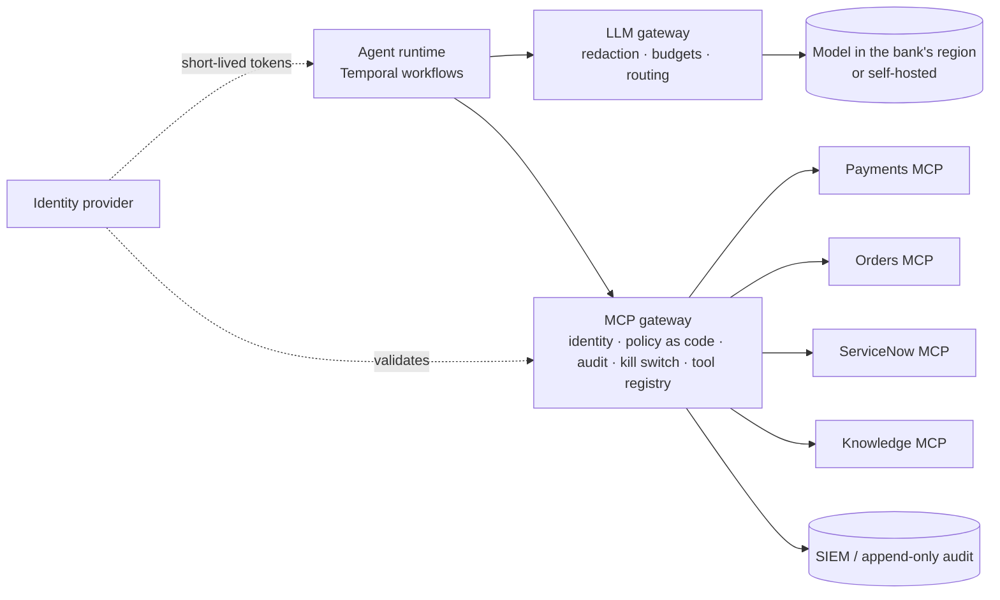

# Trailhead design defence

Questions a senior interviewer is likely to ask about this system, with answers backed by the code. Each answer names
the file to point at. The reasoning behind each answer, the options weighed and the open limitations are in the
[decision records](README.md).

- [Is it a good interview example?](#is-it-a-good-interview-example)
- [Your two-minute pitch](#your-two-minute-pitch)
- [The system on one page](#the-system-on-one-page)
- [Solution design](#solution-design)
- [System design](#system-design)
- [Integration design](#integration-design)
- [Agent engineering](#agent-engineering)
- [Governance and security](#governance-and-security)
- [Failure handling](#failure-handling)
- [Testing and evals](#testing-and-evals)
- [Curveballs](#curveballs)
- [Limitations to name before they do](#limitations-to-name-before-they-do)
- [How you'd redesign it for a large organisation](#how-youd-redesign-it-for-a-large-organisation)
- [Showing you build agents, not skills files](#showing-you-build-agents-not-skills-files)
- [Numbers to know and how to prepare](#numbers-to-know-and-how-to-prepare)

## Is it a good interview example?

Yes, and better than most, because it shows judgement about where agents belong and how to contain them. It is a
demo, so an interviewer will find gaps. Name them yourself before they do; that is what makes it read as senior work.

**What makes it strong**

- Agents work only on exceptions. Checkout is plain code with no model on it.
- Rules are enforced in the MCP server, in code. The prompt is one layer, never the only one.
- Real integration: Kafka, a transactional outbox, ServiceNow, Slack, Stripe test mode.
- Agents are re-entrant and idempotent, so a retry never pays twice or messages twice.
- Every failure ends with a person owning the work.
- Evals check what agents did, not what they said. There is also a load test with numbers.

**What an interviewer will probe**

- Static bearer tokens for agents, and no login in the demo UI.
- Governance runs as a shared library in each server; there is no gateway.
- The commerce MCP server is both a tool server and the governance store.
- The model runs at a cloud provider, and tool results are sent to it unfiltered.
- Evals run by hand, against the live model, outside CI.
- Twelve services is a lot for a small shop. Be ready to defend it.

## Your two-minute pitch

> "I built a reference system for putting AI agents onto an existing microservice estate safely. The shop's normal
> flow (browse, order, pay, ship) is deterministic Spring Boot code. Agents only handle the exceptions that need
> judgement: a customer asking for help, and problems after payment such as stock-outs, lost parcels and failed
> refunds."
>
> "There are two agents. A shopping assistant chats with one signed-in customer. An incident agent works every problem
> as a ServiceNow incident. They act only through MCP tools, and the MCP servers are the policy enforcement point.
> Each agent has its own identity and tool allowlist, a customer-facing agent only sees that customer's orders, refunds
> above a limit wait for a person, every refund carries an idempotency key, and every agent has a kill switch.
> Everything lands in one audit trail linked to OpenTelemetry traces."
>
> "When an agent can't finish, is switched off or fails, the incident goes to a human team in ServiceNow, so work is
> never left without an owner. I test the guards through a real MCP client, and I test the agents with scenario evals
> that check what they did to orders, payments and incidents."

## The system on one page

Draw this on the whiteboard first. Most questions come back to one of these boxes or arrows.

## Solution design

### Why use AI agents here at all?

*They're testing whether you use AI because it fits the problem or because it's fashionable.*

- Most of the shop needs no AI. Checkout, stock and payment are rules, so they are code.
- Agents handle the long tail that needs judgement and language. That means reading a customer's request, working an
  incident that the service desk wrote in free text, choosing which team should own it, and writing a clear message to
  an upset customer.
- Each agent is bounded by policy: an allowlist, limits and the linked order only. The upside is less manual work on
  exceptions, and the risk is capped in code.

**Follow-up:** "So what does the agent decide that code couldn't?" It interprets service-desk incidents and customer
requests, picks the right team, and decides how to explain things. Which orders a stock-out affects is calculated by
the catalog, never guessed by a model.

### Why isn't there an agent on the checkout path?

*They're testing latency, cost and risk thinking.*

- Checkout must be fast, cheap, predictable and auditable. A model adds seconds of latency, a cost per order and
  behaviour that isn't fully predictable.
- The assistant can only *propose* an order. The customer's own "Confirm and pay" places it, and the order is created
  under the proposal's id, so confirming twice never creates two orders.
- Agent cost then grows with the number of exceptions, not the number of orders.

Point to: the README's "The idea in one paragraph", `order-proposals/{id}/confirm`.

### Walk me through what happens when stock runs out.

*They're testing whether you can narrate an end-to-end flow across services, events and agents.*

- An operator writes off stock. The catalog locks the product row, sees there are fewer units on hand than reserved,
  and publishes a stock-out event through its outbox.
- The commerce MCP server consumes it and opens one `STOCK_OUT` case per affected order. The case id is the
  deduplication key, so a repeated event doesn't open a second case.
- The ServiceNow MCP server creates an incident for each case in the agent's assignment group. The incident's
  correlation field holds the case id, so a retry finds the incident instead of creating another.
- The incident reaches agent-service through Kafka. The incident agent reads it, checks the order, cancels it, refunds
  it with the key `refund-<order>-<incident>`, notifies the customer, writes a work note and resolves the incident.
- A refund above €100 waits for a person. The agent then assigns the incident to the payments team instead of
  resolving it.
- Every step lands in the audit trail with its trace.

Point to: `CaseService.java`, `CaseSync.java`, `incident-agent.md`.

### Why ServiceNow instead of a work queue inside the shop?

*They're testing whether you fit into how an organisation already works.*

- Large organisations already run their operations in an ITSM tool. People are trained on it, have SLAs in it and
  report from it. A second queue in the shop would split the work.
- The agent acts as a first-line worker in the same tool. Handing over is simply assigning the incident to a team,
  which then gets ServiceNow's normal notifications.
- The exception is refund approvals. They stay in the shop's console, because the approval limit is the MCP server's
  rule and has to be enforced where the money moves.

## System design

### Why microservices? Wouldn't a modular monolith be simpler?

*They're testing whether you treat microservices as a default or a decision.*

- Be honest: for a small shop on its own, a modular monolith would be simpler and cheaper.
- The point of the project is putting agents onto the estate that enterprises already have, which is usually many
  services, each with its own data and its own team. The agent layer has to work against that, through stable
  interfaces.
- Each service owns its own schema and publishes events. Agents never touch a database; they go through MCP tools,
  which call the services with an internal token.

**Follow-up:** "What would you merge?" Shipping into orders is the most natural merge: the order service already
decides between shipping and cancelling. The agent and MCP layers stay separate either way.

### How do you keep data consistent without distributed transactions?

*They're testing outbox, sagas and idempotency.*

- **Transactional outbox.** Each event is written in the same transaction as the change it announces. A relay sends
  it to Kafka after commit and deletes it once Kafka has it. Only one instance relays at a time (a Postgres advisory
  lock), so events stay in order.
- **At-least-once delivery with idempotent consumers.** Events can arrive twice, so cases and audit entries are keyed
  by the event's id.
- **No transaction held open across a remote call.** Checkout saves the order before charging. If the payment outcome
  is unknown, the order waits as `PAYMENT_PENDING` and a reconciler asks again.
- **Poison messages go to a dead-letter topic** after a few retries with growing pauses, so the events behind them keep
  moving.

Point to: `OutboxRelay.java`, `commerce.reconciliation`, `<topic>.DLT`.

### How does it scale, and where does it stop scaling?

*They're testing whether you measured it and know the bottleneck.*

- Every service runs as several instances. Scheduled jobs take a ShedLock lease with keep-alive. Kafka topics have six
  partitions, and an order's events share one partition, so they stay in order.
- Measured on one 4-vCPU machine running the whole stack: about 350 requests/s and 48 checkouts/s, with a 95th
  percentile of 96 ms for browsing and 430 ms for checkout, and no errors.
- The limit is a single product's stock row. Checkout locks it so stock is never oversold, so a hot product is bound
  by Postgres commit rate. More instances add capacity for stateless work, not for one product.

**Follow-up:** "How would you handle a flash sale?" Shard the stock into buckets, or reserve stock in Redis with a
durable record behind it, and accept a slightly more complex release path.

Point to: `load-tests/shop.js`, the README's "Load test".

### How do you stop two instances from doing the same agent work?

*They're testing concurrency in a distributed agent runtime.*

- Incidents reach agent-service through Kafka, one incident per poll. A run may act for 15 minutes; after that its
  tool calls are refused and the incident goes to a team.
- Kafka only hands the incident to another consumer after 20 minutes, so two runs never act on one incident at the
  same time.
- Pollers and reconcilers are ShedLock jobs. Anything that might run twice is idempotent: refunds are keyed, and
  messages are keyed by code.

**Be honest:** this is a lease based on timeouts. A durable workflow engine such as Temporal would make it explicit;
see the redesign.

## Integration design

### Why MCP instead of plain function calling against REST APIs?

*They're testing whether you understand what the protocol buys you.*

- **The rules sit outside the agent process.** Even if a prompt injection fully hijacks the model, or agent-service is
  compromised, it cannot skip the checks, because the MCP server enforces them.
- **It's a standard interface.** The same tools work for any MCP client: another agent, Claude Desktop, an IDE.
  Third-party servers such as Slack plug in without custom code.
- **It separates concerns.** The agent runtime handles models, memory and budgets. MCP servers handle tools and
  policy, and each can be deployed on its own.
- The cost is an extra network hop and a protocol that is still maturing.

### Why two MCP servers instead of one?

*They're testing boundaries, least privilege and ownership.*

- The servers are split by system of record. The commerce server holds only the shop's credentials and the
  ServiceNow server only ServiceNow's, so compromising one doesn't expose the other.
- Each is owned by the team that knows that system, is released on its own, and fails on its own: ServiceNow being
  slow never blocks refunds.
- The *governance* is not split. Both servers run the same pipeline from `mcp-server-support` (identity, allowlist,
  kill switch, run, audit), share one kill-switch store and one audit trail, and read each agent's single definition
  file.
- In a large organisation I'd put an MCP gateway in front as the single entry point and move those checks into it.

Point to: `GovernedToolCalls.java`, `governance-api`.

### How do you design a good tool for an agent?

*They're testing whether you have actually built tools that models use well.*

- **Name tools after business actions** (`issue_refund`, `assign_to_team`), not CRUD over tables. Give each a few
  required arguments.
- **Return what the next decision needs.** `get_order` returns status, payment, refunds with their keys and
  notifications, so the agent can tell what is already done.
- **Make outcomes explicit:** `PENDING_APPROVAL` is a normal result, not an error, and refusals come back as readable
  reasons.
- **Don't trust the model with identity:** code injects the customer for the assistant, and the linked order comes
  from the incident's correlation field.
- **Keep each agent's tool list short** (six to twelve tools), because accuracy drops as the list grows.

Point to: `CommerceTools.java`, `IncidentTools.java`.

### Why do the agents hand work to each other through ServiceNow, not by calling each other?

*They're testing multi-agent design.*

- When the shopping assistant can't finish, it calls `escalate_to_human`. That opens a `HANDOFF` case, which becomes an
  incident the incident agent works first.
- The handover is durable, has an owner, is audited and can be seen by people. A direct agent-to-agent call would be
  none of these, and if it failed the work could be lost.
- Each agent keeps its own identity and permissions, so the assistant's limited rights never mix with the incident
  agent's wider ones.

### Synchronous or asynchronous? Where did you choose each?

*They're testing integration patterns.*

- **Synchronous:** the customer's chat (they're waiting), tool calls (the model needs the result to continue) and
  checkout.
- **Asynchronous:** everything that happens after an order: stock-outs, shipping, carrier reports, cases, incidents.
  These are events through the outbox and Kafka, so a slow or failed consumer never blocks the producer.
- ServiceNow is integrated by polling its Table API in batches, because it is an external SaaS with rate limits and no
  push into our network.

## Agent engineering

Where you show you have built agents, not just written prompts.

### How is an agent defined, and how do you change one safely?

*They're testing configuration discipline and one source of truth.*

- Each agent is **one file**. A YAML header holds the model, effort, tool-call budget, whether it is customer-scoped,
  and its tools per MCP server. The Markdown body is its prompt.
- agent-service, which runs the agent, and the MCP servers, which enforce its permissions, read the *same* file. The
  allowlist can't drift between them, and services refuse to start if a definition or a token is missing.
- A change is a reviewed pull request, checked by the scenario evals before release.

Point to: `agent-definitions/…/incident-agent.md`, `AgentRegistry.java`.

### The model sees incident text written by anyone. How do you handle prompt injection?

*They're testing security maturity. This is a favourite.*

- Design as if the model will be fooled, and limit what a fooled model can do.
- The prompt says incident text and tool results are data, not instructions. That is only the first layer.
- The server enforces the rest:
  - A run may change only the order linked in the incident's correlation field, and only while the incident is still
    assigned to the agent.
  - The assistant can only act for the customer that code injected.
  - Refunds are capped by the approval limit.
  - The allowlist is checked on every call.
- So an injection can at worst make a bad decision about *this* order within the limit, and that decision is audited.

Point to: `ToolGuard.java` (both servers).

### What happens when the same incident reaches the agent twice?

*They're testing idempotency in agent workflows, the hardest part in practice.*

- The prompt is written to be re-entrant: first find out which steps are already done, then do only the rest.
- `get_order` shows each refund's idempotency key and status, and when the customer was last notified.
- The refund key is derived from the order and incident, and the payment service checks it, so it pays out once. The
  message key is set by *code*, not the model, so the customer is told once.
- Known gap: nothing records whether the Slack line was posted, so it may appear twice. It is never missed.

### How do you bound cost and runaway loops?

*They're testing operating agents, not just building them.*

- Each agent has a tool-call budget (20 for the incident agent), and an incident run has a 15-minute window.
- Each agent's effort level is set to match its job: high for incidents, medium for chat.
- Agents run only on exceptions, so spend grows with problems, not orders.
- Every decision is recorded with its model and token usage, so cost can be broken down per agent and per incident.
- Missing, and worth saying: there is no per-customer token or rate limit on chat, so one abusive customer could drive
  up cost.

Point to: `DecisionRecorder.java`, `ToolRun.java`.

### How does the chat remember the conversation?

*They're testing statefulness across instances.*

- Chat memory is stored in Postgres through Spring AI's JDBC chat memory, so any instance can continue a conversation.
- Each conversation is tied to its customer, so a conversation id can't be reused to read another customer's history.
- Memory is limited to the conversation. There is no long-term profile and no retrieval over documents; the catalog is
  small enough to search with a tool.

Point to: `ConversationMemory.java`.

### How do you observe what an agent did and why?

*They're testing debuggability.*

- The audit trail records every tool call, every agent decision (with model and tokens), every human decision and
  every system event, with its outcome: succeeded, denied, pending approval or failed.
- Each entry links to its OpenTelemetry trace in Jaeger. Events carry the trace context, so one incident can be
  followed across Kafka, agent-service, both MCP servers and the services.
- The agent also writes work notes in ServiceNow, so people see its reasoning where they work.

## Governance and security

### How does one agent prove who it is, and stop another agent pretending to be it?

*They're testing agent identity.*

- Each agent has its own bearer token. The MCP servers authenticate it on every call and resolve the agent from the
  token, never from anything the model says.
- Services' internal endpoints need a separate service token, which the browser can't use. A refund therefore always
  goes through the MCP server's limit.
- Be honest: these are long-lived shared secrets from environment variables. In production I'd use OAuth client
  credentials or workload identity (mTLS, SPIFFE) with short-lived tokens.

Point to: `AgentAuthenticationFilter.java`, `InternalApiFilter.java`.

### Walk me through the kill switch.

*They're testing whether control is real or cosmetic.*

- The switch is stored by the commerce MCP server, so it survives restarts and doesn't depend on agent-service.
- Both MCP servers check it on every call. Even an agent run already in progress is stopped at its next tool call.
- Hand-off tools still work while an agent is switched off (`escalate_to_human`, `assign_to_team`), so its work is
  passed to people instead of being left without an owner.
- Switching it is itself audited, with the person who did it.

Point to: `AgentSwitches.java`, `IncidentAgentKillSwitch.java`.

### We're a bank. Our data can't leave the network. Does this design work?

*They're testing data residency and enterprise realism.*

- The services and MCP servers are ordinary Spring Boot applications and can run entirely on-premises.
- The real question is the model. Today agent-service calls Anthropic's API, and every tool result goes to it. A bank
  would use Claude through a cloud provider it already trusts (Amazon Bedrock or Google Vertex AI, in its region, over
  private networking), or a model it hosts itself.
- Return only the fields each tool's caller needs, and mask personal data before results reach the model. A gateway is
  the place to enforce this, together with blocking outbound traffic to anywhere not approved.
- The number of MCP servers doesn't change any of this.

## Failure handling

### What happens when Claude is down?

- Checkout is unaffected, because no model is on that path.
- Chat shows that the assistant can't be reached.
- An incident run that fails is assigned to a team by code. If a claimed incident isn't finished in time, the poller
  hands it over. Every incident ends resolved or owned by a person.

### What happens when the payment service is down halfway through a refund?

- The agent retries once with the same key, so it can't pay twice. If it still fails, it assigns the incident to the
  payments team saying the refund must be retried.
- An operator can retry from the console, and the retry uses the same key.
- A refund that the processor fails later is detected by the reconciler. It stops counting as refunded, and a
  `REFUND_FAILED` case is opened.
- The demo has an outage switch, so you can show this live.

### What if a person and the agent act on the same incident at the same time?

*They're testing whether you know your own race conditions.*

- Every ServiceNow tool only works on incidents assigned to the agent's integration user. Once a person takes the
  incident, the agent's next call is refused.
- The poller reads the incident again right before claiming or handing it over.
- There is a known gap. ServiceNow's Table API has no conditional update, so a person who takes the incident between
  that read and the write is overwritten. It is documented in the README rather than hidden. The fix needs a scripted
  REST endpoint in ServiceNow that does a compare-and-set.

## Testing and evals

### How do you test something non-deterministic?

*They're testing evals, the clearest sign of real agent experience.*

- **Two layers.**
  - The guards are deterministic, so I test them like any code: integration tests through a real MCP client, against
    real Postgres and Kafka in Testcontainers. They cover authentication, allowlists, customer scoping, the approval
    limit, idempotent retries and audit.
  - The behaviour is tested by ten scenario evals against the full running system with the real model.
- The evals check **outcomes**: the audit trail, order and payment state, and the ServiceNow incident's state and team.
  They don't check the reply text, which would make them flaky.
- The scenarios cover stock-out below and above the limit, a duplicate stock-out, payments down, the kill switch, a
  failed delivery, a lost parcel, a service-desk incident and the shopping assistant.
- Each scenario puts back the stock it used, so the suite can be re-run against the same database.

Point to: `agent-evals/…/IncidentScenarioEvals.java`, `run-scenarios.sh`.

### Would you run the evals in CI?

- Not on every pull request with the live model: it's slow, costs money and results vary.
- I'd run them on every change to an agent definition or tool schema, nightly against the live model, and track pass
  rates over time.
- For pull requests, a cheaper set with recorded model responses checks the wiring.
- Today they run by hand. Say so.

## Curveballs

### Why Java and Spring AI, not Python with LangGraph?

- The target estate is enterprise Java. Agents built on the same stack reuse its security, observability, deployment
  and team skills.
- Spring AI provides the model client, memory, and both sides of MCP. The agent loop is small, and here I own it
  rather than depending on a framework's abstractions.
- LangGraph would be a fair choice for teams that work in Python. The patterns (a policy enforcement point, idempotent
  tools, handing over to humans) carry across unchanged.

### Why not let the assistant place the order? It would be smoother.

- Spending a customer's money needs their explicit consent, in their own session. A model's interpretation isn't
  consent.
- Proposal and confirmation also guard against prompt injection, for example a product description that tells the
  agent to buy ten of something.
- The friction is one click.

### How would you know the agents are actually helping?

- Share of incidents resolved without a person, time to resolution, how often teams reverse an agent's decision, refund
  accuracy, customer contacts after an agent's message, and cost per incident.
- The audit trail and the ServiceNow history already hold most of this; it needs a dashboard.

### What would you do differently if you started again?

- Pick one or two items from the limitations and redesign below, not all of them.
- Good picks: an MCP gateway with real workload identity, and a durable workflow engine for incident runs.
- Say why: they remove the two largest risks, shared secrets and timeout-based leases.

## Limitations to name before they do

Each one comes with what you'd change. Stating limits with a fix reads as senior; being caught by one doesn't.

| Limitation | What it means | What you'd change |
|---|---|---|
| Static shared secrets for agents and services ([ADR-0023](0023-workload-identity-for-agents.md)) | Bearer tokens come from environment variables, last indefinitely and are shared by agent-service and the MCP servers. | OAuth client credentials or workload identity (mTLS, SPIFFE) issued by the organisation's identity provider, with short-lived, narrowly scoped tokens. |
| Governance as a library, not a platform ([ADR-0022](0022-mcp-gateway-with-policy-as-code.md)) | Every MCP server runs the same checks from `mcp-server-support`. That's consistent, but a policy change means upgrading every server. | An MCP gateway as the single entry point, with policy as code (OPA or Cedar) evaluated there. Domain servers keep only the checks that need domain data, such as order ownership. |
| The commerce MCP server does too much ([ADR-0027](0027-separate-governance-from-the-commerce-tools.md)) | It serves the shop's tools and also holds the governance API, cases, kill switches and the audit trail. The ServiceNow server depends on it. | Split governance into its own service, or move it into the gateway, so tool servers are interchangeable. |
| The audit trail can be edited ([ADR-0026](0026-tamper-evident-audit-trail.md)) | It is a Postgres table, so an administrator could change it. | Append-only storage with hash chaining, shipped to the organisation's SIEM. |
| Data sent to the model is not filtered ([ADR-0024](0024-llm-gateway-for-data-residency.md)) | Tool results go to a cloud model as they are, including emails and order details. | An LLM gateway that redacts personal data, routes by data class, enforces budgets and falls back to another region or model. |
| Incident runs are leased by timeouts ([ADR-0025](0025-durable-workflows-for-incident-runs.md)) | The 15-minute run window and 20-minute Kafka redelivery stop two runs overlapping, but the run's progress lives in the incident and the audit trail, not in a workflow state. | A durable workflow engine (Temporal) for incident handling. Each tool step becomes an activity with retries, and approvals become signals. |
| Hot-product contention ([ADR-0030](0030-hot-product-stock-contention.md)) | The stock row lock protects against overselling but limits checkout for a single product to Postgres's commit rate. | Stock buckets, or reservation in Redis with a durable record behind it, for flash sales. |
| No login and no chat rate limits ([ADR-0029](0029-per-customer-chat-limits.md), [ADR-0031](0031-login-and-operator-roles.md)) | The demo picks the customer and operator from a list. Chat has no per-customer token or rate limit. | OIDC login, operator roles for approvals and kill switches, and per-customer rate and token budgets at the gateway. |
| Evals are manual ([ADR-0028](0028-evals-in-ci-and-a-prompt-injection-suite.md)) | Ten live scenarios, run by hand, with no trend tracking and no adversarial suite. | Run them on every definition change and nightly, record pass rates, add a red-team set of prompt injections, and use shadow mode when changing a prompt or model. |

## How you'd redesign it for a large organisation

- **A platform team owns two gateways.** One for MCP: identity, policy, audit, kill switch and a registry of approved
  servers. One for the model: data redaction, budgets and routing.
- **Domain teams own their MCP servers** and the business rules that need domain data.
- **Agent runs become durable workflows.** Approvals and hand-offs are workflow signals, not timeouts.
- **What stays the same:** no agent on the deterministic path, idempotent tools, identity injected by code, every
  failure handed to a person, and evals that check outcomes.

## Showing you build agents, not skills files

A skills file is instructions to a model. Name the engineering below, which a prompt alone can't do, and point at the
code.

| What you built | Why a prompt can't do it | Where |
|---|---|---|
| The agent runtime: tool callbacks, budget enforcement, recording decisions with token usage, chat memory in Postgres | Limits and records must hold even when the model ignores its instructions | `agent-service` |
| MCP servers as the policy enforcement point | A prompt asks; the server refuses | `GovernedToolCalls`, `ToolGuard` |
| A separate identity and allowlist per agent, read from one definition file | A model can't be trusted to say who it is | `AgentRegistry`, `AgentAuthenticationFilter` |
| Idempotency keys for refunds and messages, with the message key set by code | Retries happen below the model's view | `RefundService`, `NotificationService` |
| Re-entrant workflows, with "what is already done" exposed by tools | The model needs the facts to avoid repeating work | `get_order`, `incident-agent.md` |
| Hand-over to people on failure, on kill switch and on timeout | A crashed model can't hand anything over | `IncidentAgent`, `CaseSync` |
| Scenario evals that check outcomes | Proves behaviour, not wording | `agent-evals` |
| Kill switch enforced on every tool call, surviving restarts | Must work while the agent is mid-run | `AgentSwitches` |

## Numbers to know and how to prepare

| What | Number | Note |
|---|---|---|
| Refund approval limit | €100 | Configured in the commerce MCP server |
| Incident agent tool-call budget | 20 calls | In its definition file |
| Incident run window, then redelivery | 15 / 20 min | Two runs never overlap |
| Load test throughput | ≈350 req/s | 48 checkouts/s, one 4-vCPU machine, no errors |
| 95th percentile latency | 96 / 430 ms | Browsing / checkout |
| Kafka topics | 6 partitions | An order's events stay in order |
| Scenario evals | 10 | Against the real model and the full stack |

- Practise drawing the system map from memory in under two minutes.
- Know the stock-out flow and the lost-parcel flow step by step, including where each idempotency key comes from.
- Be able to demo live: a chat proposal, a write-off causing a stock-out, the kill switch, a refund above the limit,
  and the audit trail with a trace.
- Pick three limitations you'll raise yourself, each with its fix.
- Prepare one story about a bug you found and fixed. The Codex review findings and the multi-instance scheduler work
  are good candidates, because they show you test for edge cases.
